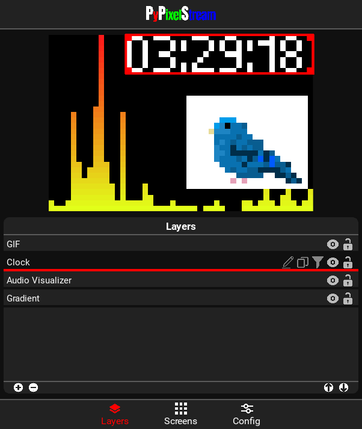

PyPixelStream is a cross-platform live streaming software designed specifically for low-resolution LED panels. Inspired by OBS (Open Broadcaster Software), this project was born with the goal of facilitating the management and transmission of content to LED screens, addressing the particular needs of low-resolution visual media. PyPixelStream is under constant development, aiming to become a comprehensive solution for various LED panel configurations.

<div align="center">
    
</div>

## Installation
### Windows
```bash
git clone https://github.com/offerrall/PyPixelStream
cd PyPixelStream
pip install -r requirements.txt
cd src
main.py
```
### Linux and macOS
```bash
git clone https://github.com/offerrall/PyPixelStream
cd PyPixelStream
pip3 install -r requirements.txt
cd src
python3 main.py
```

## Sources and Filters

### Media Sources
- **Image**: Displays an image on the screen.
- **Video**: Plays a video on the screen.
- **Webcam**: Shows the webcam feed on the screen.
- **Screen Capture**: Captures the screen and displays it on the screen.
- **GIF**: Plays a GIF on the screen.
- **Audio Visualizer**: Displays an audio visualizer on the screen.
### Text Sources
- **Text**: Displays a text on the screen.
- **Clock**: Displays a clock on the screen.
- **Timer**: Displays a timer on the screen.
- **Stopwatch**: Displays a stopwatch on the screen.
- **Date**: Displays the date on the screen.
- **System Monitor**: Displays system information on the screen.
- **Criptocurrency**: Displays cryptocurrency information on the screen.
### Effects
- **Solid Color**: Fills the screen with a solid color.
- **Gradient**: Fills the screen with a gradient.
- **Rainbow**: Fills the screen with a rainbow.
- **Game of Life**: Displays the Game of Life on the screen.
- **Color Frizzles**: Effect that creates a color frizzles on the screen.
- **Snow Fall**: Effect that creates a snow fall on the screen.
- **Rainbow Twister**: Effect that creates a rainbow twister on the screen.
- **Random Chase**: Effect that creates a random chase on the screen.
### Filters
- **Brightness and Contrast**: Adjusts the brightness and contrast of the source.
- **Chrome Key**: Removes a color from the source.
- **Circle Mask**: Masks the source with a circle.
- **Custom Mask**: Masks the source with a custom shape.
- **Gray Scale**: Converts the source to gray scale.
- **Flip**: Flips the source horizontally or vertically.
- **Wrap Around**: Wraps the source around the screen.

## Technologies
PyPixelStream is built with Python and uses the following libraries:
- **Kivy**: Open source Python library for developing multitouch applications.
- **NumPy**: Numpy is the main library for PyPixelStream, it is the base for all the image processing.
- **Plyer**: For Video and Webcam sources.
- **ffpyplayer**: For the Video and Webcam sources.
- **PyObjus**: Compatibility with Mac OS.
- **Art**: Generate the pixel art letters.
- **requests**: For the cryptocurrency source.
- **pillow**: For the GIF source.
- **mss**: For the screen capture source.
- **psutil**: For the system monitor source.
- **pyaudiowpatch**: For the audio visualizer source, only on Windows.

*pyaudiowpatch must be installed manually, it is not included in the requirements.txt file.

## TODO
- [ ] Add Documentation.
- [ ] Add more sources and filters.
- [ ] Add Compatibility with more LED panels.
- [ ] Add a ui for the configuration of the LED panels.
- [ ] Add events for the sources and filters, like twitch alerts.

## Contributing
This is my first open source project, so I'm open to any kind of contribution, from code to documentation, to design and more. If you want to contribute, please fork the repository and make a pull request.
If you have any questions or bugs, please open an issue.

## License
PyPixelStream is licensed under the MIT License. See [LICENSE](./LICENSE) for more information.